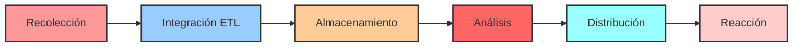
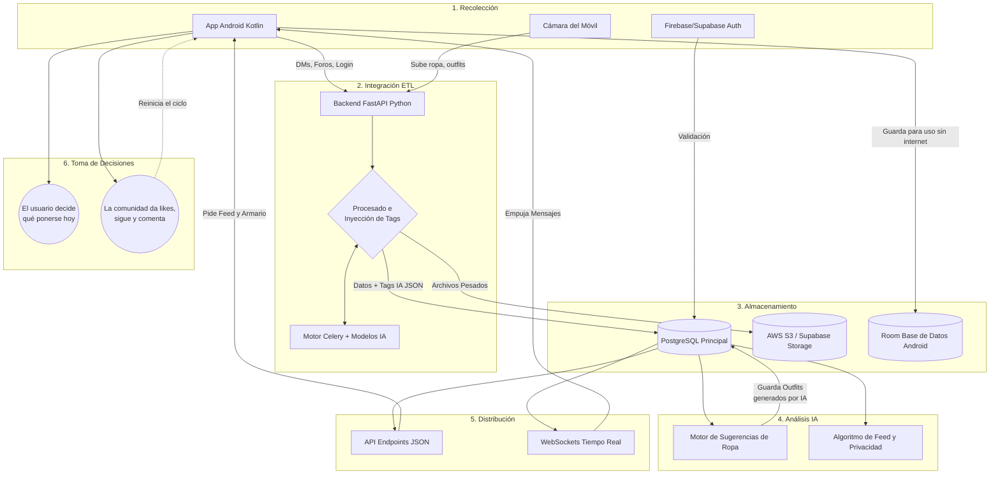

# Arquitectura de mi Red Social de Moda
*(Basada en el modelo de Inteligencia de Negocios y Data Pipeline)*

Para diseñar el flujo de datos de mi app (Android con Kotlin y Backend con Python), me he basado en una arquitectura típica de *Business Intelligence* (BI), adaptándola a las necesidades de mi red social con armario virtual y foros.

## 1. Recolección (Collect)
El objetivo de esta fase es capturar todos los datos crudos desde las diferentes fuentes de mi sistema.

*   **API y App Móvil:** Mi app en **Android (Kotlin)** captura todas las interacciones de los usuarios: creación de perfiles (`PROFILES`), envío de mensajes directos (`DIRECT_MESSAGES`), y publicaciones en los foros (`FORUM_MESSAGES`).
*   **Sensores (Cámara):** A través del móvil del usuario, capturo y subo fotos de prendas para alimentar su armario virtual (`GARMENTS`) y los conjuntos que publica en el feed (`POSTS`).
*   **Servicios Cloud Externos:** Uso sistemas como Firebase Auth o Supabase para poblar mi base de datos de usuarios inicial y gestionar los inicios de sesión.

## 2. Integración y Procesamiento (Integrate)
Aquí es donde transformo los datos en crudo que capturo por la app y los preparo. Hago un proceso ETL (Extract, Transform, Load) directamente en mi backend:

*   **Extract:** Mi servidor en Python (FastAPI) recibe desde Android la foto de la prenda y los metadatos manuales (como la marca o el color principal).
*   **Transform (Mi IA):** Este es un paso clave en el valor de mi app. Mando la imagen a un modelo de IA usando tareas en segundo plano (Celery). La inteligencia artificial analiza la prenda, extrae etiquetas automáticas, categoriza el estilo e incluso puede leer códigos de barras. Toda esta riqueza de datos va al campo `tags_ai` en formato JSON.
*   **Load:** Guardo esta información estructurada en mi base central de PostgreSQL. Aquí también inyecto mi lógica de negocio de privacidad: si la cuenta es privada (`is_private`), marco las nuevas solicitudes de `FOLLOWERS` como "pendientes".

## 3. Almacenamiento (Store)
El corazón de mi sistema, donde alojo la información procesada.

*   **Data Warehouse (PostgreSQL):** Aquí tengo todas mis tablas transaccionales (publicaciones, hilos del foro) y las de estado social (perfiles, seguidores). Idealmente gestionado con Supabase por su rapidez e integración.
*   **Storage Multimedia (S3):** Uso AWS S3 o los Buckets de Supabase para guardar físicamente las fotos pesadas y servir las URLs.
*   **Data Marts Locales (Caché Offline):** En mí código de Android uso **Room Database (SQLite)**. Funciona como un pequeño repositorio local súper rápido para que mis usuarios puedan abrir y usar su **Armario Virtual** (`GARMENTS` y `OUTFITS`) sin tener que esperar a que cargue internet.

## 4. Análisis (Analyze)
En esta fase aplico lógica inteligente para generar "Inside" o recomendaciones de valor.

*   **Motor de Recomendaciones (Python):** He planteado scripts que analizan el armario de un usuario y la forma en que ha clasificado su ropa (`OUTFIT_GARMENTS`) para sugerirle nuevas combinaciones de atuendos automáticas (haciendo filas en `OUTFITS` con un valor `is_ai_generated = true`).
*   **Análisis y Filtrado del Feed:** Una serie de vistas en mi SQL que analizan a quién sigues (la tabla `FOLLOWERS` con estado aceptado) y curan qué publicaciones (`POSTS`) debes ver en tu pestaña principal.

## 5. Distribución (Distribute)
Aquí devuelvo ordenadamente la información a las interfaces visuales.

*   **Endpoints REST:** Mi servidor web envía JSONs ligeros y limpios de vuelta a Kotlin cuando la app solicita armarios, foros o el inicio.
*   **WebSockets (En Vivo):** Distribuyo la mensajería de forma reactiva, empujando los mensajes de texto de los DMs rápidos y los debates candentes de mis foros directamente a las pantallas móviles, sin que recarguen.

## 6. Toma de Decisiones (React)
El final del ciclo, donde toda esta arquitectura técnica impacta a mi usuario final (Data-Driven Decisions):

*   **Decisiones de Moda Vistas en la App:** El usuario abre su armario por la mañana, mira las recomendaciones analizadas por la IA (fase de Análisis) y decide efectivamente **qué combinación se va a poner hoy**.
*   **Feedback Social (Loop de Retorno):** A raíz de mirar el feed, mis usuarios deciden darle a "seguir" a un nuevo perfil, darle like a un atuendo impresionante, o aceptar a un amigo en su cuenta privada. Esta interacción es transmitida de vuelta a la app, reiniciando el bucle desde la fase 1 (Recolección).

---

### Mapa Detallado del Flujo (Mermaid)

